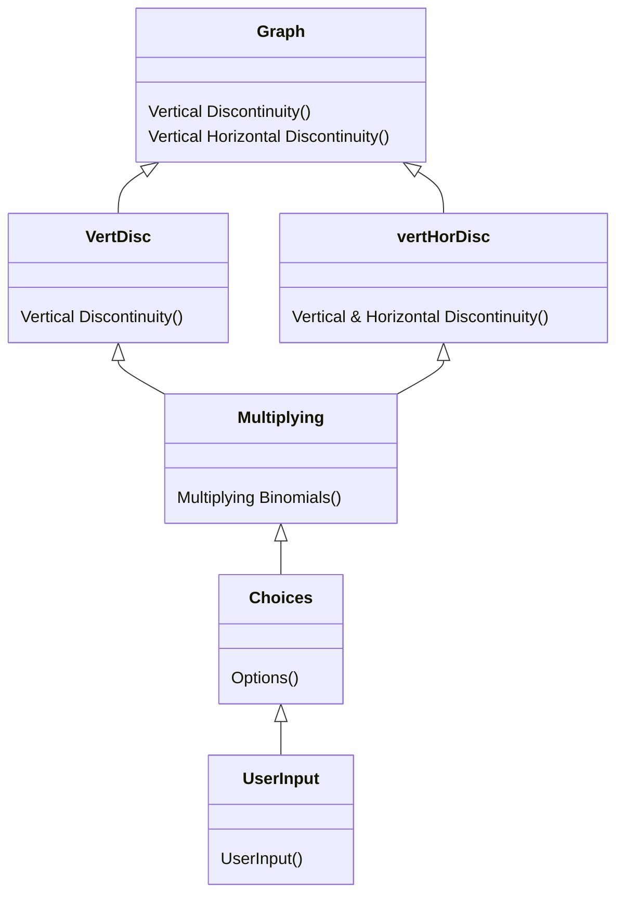

<!-- Put your UML Diagaram Here -->

```mermaid

classDiagram

class Graph
Graph : Vertical Discontinuity()
Graph: Vertical Horizontal Discontinuity()

class  Vert Disc
Graph <|-- Vert Disc
Vert Disc : Vertical Discontinuity()

class  vertHorDisc
Graph <|-- vertHorDisc
vertHorDisc : Vertical & Horizontal Discontinuity()

class Multiplying
Multiplying : Multiplying Binomials()
Vert Disc <|-- Multiplying
vertHorDisc <|-- Multiplying

class Choices
Choices : Options()
Multiplying <|-- Choices

class UserInput
UserInput : UserInput()
Choices <|-- UserInput

```